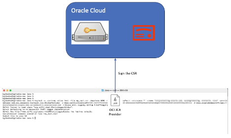
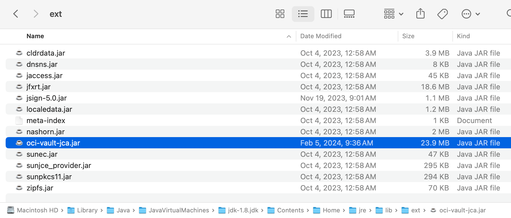
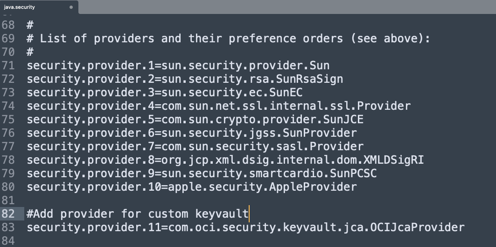
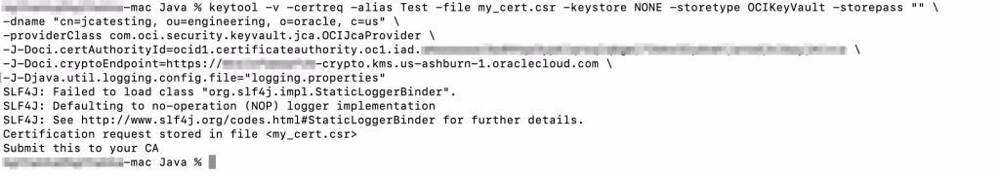

# Overview
CA/B forum released new standards for subscriber key protection requirements. As part of the new requirements, a code signing certificate private key must be stored in FIPS compliant HSM device.

Oracle cloud offers fully managed Key Management service that stores and manages keys in FIPS compliant HSM device. Customers can use the service to create PKI and use that for code signing. The standard process for code signing certificate with OCI vault would look like below.

1. Create Public-Private key pair in OCI vault.
2. Generate CSR (Certificate Signing Request) using the keys.
3. Get CSR signed from trusted well-known CA and get code signing certificate.
4. Use Private key from OCI vault and code signing certificate to sign the code (jar file).

# Generating CSR using the JCA provider
This document contains 1st and 2nd steps. !(SignJarFile.md) will cover instructions and setup for the jarsigner.

# Setup

## Pre-Requisites
1. You need Java 8 or above to use the JCA library.
2. You need OCI subscription.
3. You need OCI cli setup on the machine to use the JCA library.

## Step 1: OCI Setup

### Step 1.1: Create Vault
1. Login to OCI console using KMS Admin user.
2. Open the navigation menu, click Identity & Security, and then click Vault.
3. Under List scope, select the compartment in which you want to create the vault.
4. Click Create Vault.
5. In the Create Vault dialog box, provide the following details:
    If needed, select a different compartment in which you want to create the vault.
    Enter a name for the vault.
    Select Make it private vault if you want a dedicated partition in a hardware security module (HSM).
    Note:
    JCA provider supports both Virtual Vault and Private Vault.
    You cannot change the vault type after the vault is created.
6. Now, Click Create Vault.
7. Once the vault is created, copy crypto endpoint of the vault. We will require that in the last step to run keytool command.

### Step 1.2: Create key
1. From OCI console, Open the navigation menu, click Identity & Security, and then click Vault.
2. Under List scope, select a compartment that contains the vault.
3. Click the name of the vault where in which you want to create the key.
4. Under resources, click Master Encryption Keys, and then click Create Key.
5. Click Master Encryption Keys, and then click Create Key. Keys can also exist is a different compartment then the vault.
6. For Protection Mode, select HSM option.
7. Enter a name to identify the key. 
8. For Key Shape: Algorithm, select RSA algorithm.
9. If you selected AES or RSA, select the corresponding key shape length in bits.
Note: Most public CAs do not accept 2048 key length. So, choose either 3072 or 4096.
10. click Create Key.

### Step 1.3: Create Signing Cert Authority
Once the key is created, use the key to generate signing cert authority. Keytool requires a private key certificate to create CSR. Please note that it is keytool requirement and CSR creation doesn’t require it. To overcome this limitation, I am working on python utility to create CSR using just the PKI without the certificate. I will publish that in a couple of weeks.

1. Login to OCI console using the KMS and certificates admin user.
2. Open the navigation menu and click Identity & Security.
3. Under Certificates, click Certificate Authorities.
4. Click Create Certificate Authority.
5. Click Compartment, and then choose the compartment where you want to create the CA.
6. Under Certificate Authority Type, choose “Root Certificate Authority” from available options:
7. Enter a display name for the CA. This name helps you identify the CA for administrative purposes but doesn't appear as part of the CA certificate.
8. Click Next.
9. Provide subject information. Subject information includes at least a common name to identify the owner of the CA certificate. Depending on the certificate's intended use, the subject might identify a person, organization, or computer endpoint. The format of the subject information must conform to RFC 5280 standards.
10. When you're ready, click Next.
11. (Optional) Click Not Valid Before, and then specify the UTC time and date when you want to begin using the CA. If you don't specify a date, then the CA validity period begins immediately.
12. Click Not Valid After, and then specify the date after which the CA can no longer be used to issue or validate subordinate CAs or certificates. (You must specify a date at least one day later than the starting date of the validity period. You can't specify a date beyond December 31, 2037. Values are rounded up to the nearest second.)
13. Under Vault, choose the vault that you created in previous step.
14. Under Key, choose the key in the vault that you want to use. The list includes only the asymmetric keys in the vault because Certificates only supports asymmetric keys. Make sure to choose the key that you created in the last step.
15. Under Signing Algorithm, choose one of the following options, depending on the key algorithm family:
    SHA256_WITH_RSA: RSA key with a SHA-256 hash function
    SHA384_WITH_RSA: RSA key with a SHA-384 hash function
    SHA512_WITH_RSA: RSA key with a SHA-512 hash function
    SHA256_WITH_ECDSA: ECDSA key with a SHA-256 hash function
    SHA384_WITH_ECDSA: ECDSA key with a SHA-384 hash function
    SHA512_WITH_ECDSA: ECDSA key with a SHA-512 hash function
    When you're ready, click Next.

16. Configure the expiry rule. Under Maximum Validity Duration for Certificates (Days), specify the maximum number of days that a certificate issued by this CA can be valid. We strongly recommend a validity period of no more than 90 days.
17. Under Maximum Validity Duration for Subordinate CA (Days), specify the maximum number of days that a CA issued by this CA can be valid to issue other CAs or certificates. When you're ready, click Next.
18. On the Revocation Configuration page, if you don't want to configure a certificate revocation list (CRL), select the Skip Revocation check box.
19. When you're ready, click Next.
20. Confirm that the information is correct, and then click Create Certificate Authority. It can take a while to create certificate-related resources.
21. Once cert authority is created, copy cert authority OCID. We will require that in the last step to run the keytool command.

## Step 2: JCA Provider
The Java Cryptography Architecture (JCA) is a framework for working with cryptography using the Java programming language. It forms part of the Java Security. It uses provider-based architecture and contains a set of APIs for various purposes like encryption, key management, signing, hashing, signature verification, etc.

You can write custom implementations of the provider. Most cloud providers have JCA provider for key management service on those respective clouds. Similarly, for Oracle cloud, you can download JCA provider (oci-vault-jca.jar) from the Github.

To configure Java to use the provider, you need below configuration.

1. Add JCA provider jar to the Java environment by copying JCA provider jar in the {JAVA_HOME}/jre/lib/ext.

2. Modify java.security file from $JAVA_HOME}/jre/lib/security in your Java environment to include the OCI JCA provider.

# Generate CSR using the keytool
Once the JCA provider is configured and OCI key is created, you can run the following command to generate CSR. Following is the list of parameters.

Alias: This is name of the certificate authority you created in step 1.3
File: File name of the CSR
Dname: Fully qualified domain name for the CSR
certAuthorityId: OCID of the certificate authority created in step 1.3.
cryptoEndpoint: Crypto endpoint for the OCI key created in step 1.2.

keytool -v -certreq -alias ${Alias} -file ${File} -keystore NONE -storetype OCIKeyVault -storepass "" \
-dname "${Dname}" \
-providerClass com.oci.security.keyvault.jca.OCIJcaProvider \
-J-Doci.certAuthorityId=${certAuthorityId} \
-J-Doci.cryptoEndpoint=${cryptoEndpoint} \
-J-Djava.util.logging.config.file="logging.properties"

# Conclusion
Once the CSR is created, you can submit CSR to the certificate signing authority to get signed certificate. Generating CSR is not the only use case of JCA provider. You can use it for encryption-decryption, signing-verification, and lot of other cryptographic use cases in your java application. One immediate use case that we envision is code signing jar files. That will be covered in the next blog.