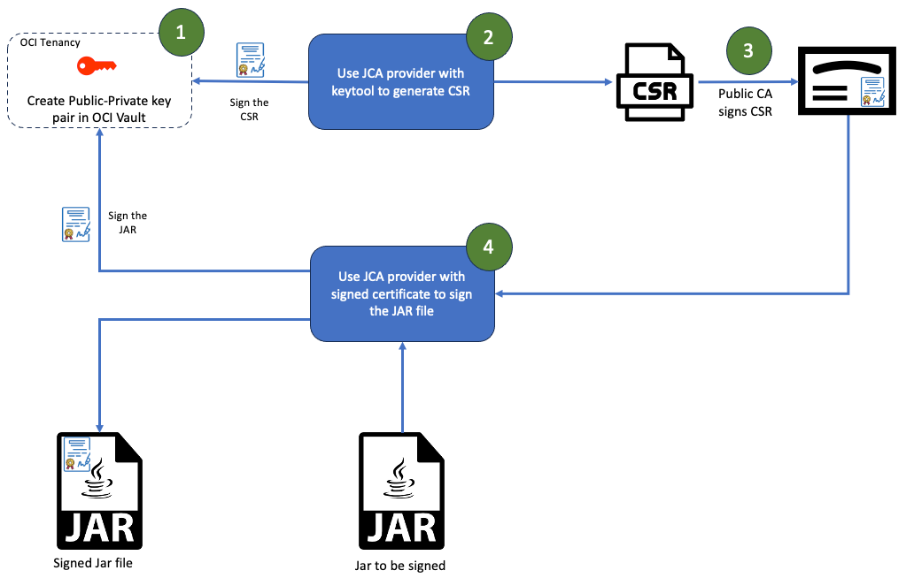

# OCI-KMS-JCA

The Java Cryptography Architecture (JCA) is a framework for working with cryptography using the Java programming language. It forms part of the Java security. It uses provider-based architecture and contains a set of APIs for various purposes like encryption, key management, signing, hashing, signature verification, etc. This project provides custom implementation of the JCA interfaces to leverage OCI vault for content signing. 

# Getting started

### Pre-requisites

1. [Java 8](https://www.oracle.com/java/)
2. [OCI Cli](https://docs.oracle.com/en-us/iaas/Content/API/SDKDocs/cliinstall.htm)

## Add your files

- [ ] [Create](https://docs.gitlab.com/ee/user/project/repository/web_editor.html#create-a-file) or [upload](https://docs.gitlab.com/ee/user/project/repository/web_editor.html#upload-a-file) files
- [ ] [Add files using the command line](https://docs.gitlab.com/ee/gitlab-basics/add-file.html#add-a-file-using-the-command-line) or push an existing Git repository with the following command:

```
cd existing_repo
git remote add origin https://orahub.oci.oraclecorp.com/ateam/oic-kms-jce.git
git branch -M main
git push -uf origin main
```

## Installation
You can use the library in your Java application to perform cryptographic operations. One target use case is to use OCI vault keys to sign jar files. Refer to below blog posts to learn more about it.



1. [Using OCI JCA provider to generate CSR](https://www.ateam-oracle.com/post/oci-jca-provider-use-case-generate-csr)
2. jarsigner blog ling (TBD)

## Roadmap
I am planning to add following updates to the library over next few months.

1. Adding automated build process
2. Adding test classes 
3. Support non default profiles and instance principal for OCI Integration

## Contributing
If you want to contribute or address any gaps, you can find more information from the [CONTRIBUTING](https://github.com/kiranthakkar/oci-kms-jca/blob/main/CONTIBUTING.md) page.

## License
The library is licenses under Apache License 2.0. You can find more details from the [LICENSE](https://github.com/kiranthakkar/oci-kms-jca/blob/main/LICENSE.txt) page.
