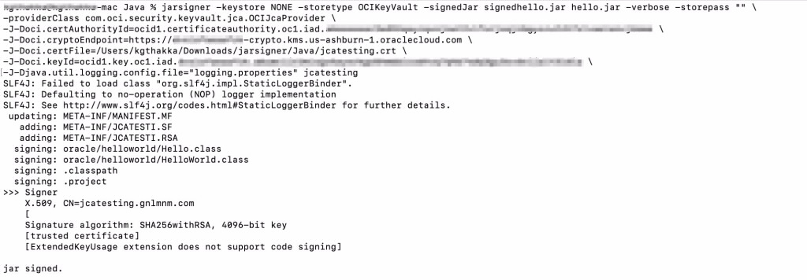
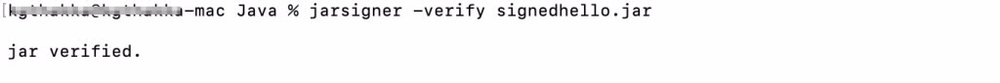

# Overview
CA/B forum released new standards for subscriber key protection requirements. As part of the new requirements, a code signing certificate private key must be stored in FIPS compliant HSM device.

Oracle cloud offers fully managed Key Management service that stores and manages keys in FIPS compliant HSM device. Customers can use the service to create PKI and use that for code signing. The standard process for code signing certificate with OCI vault would look like below.

1. Create Public-Private key pair in OCI vault.
2. Generate CSR (Certificate Signing Request) using the keys.
3. Get CSR signed from trusted well-known CA and get code signing certificate.
4. Use Private key from OCI vault and code signing certificate to sign the code (jar file).

In this document, I will talk about the second part that is signing jar files using the JCA provider and signing certificate. 

# Setup
From a setup perspective, I assume you have followed the steps (OCI Setup and JCA setup) from .

Once the CSR is signed and you receive the signer certificate, we use the signed certificate along with the JCA provider to sign the jar file. Like the keytool command, the jarsigner command also requires some command line parameters related to OCI. Those parameters are below. You may have received signed certificate along with certificate chain from the CA. Extract pem signed certificate. You also need to create certificate chain file. If the Intermediate certificate is provided then create cert chain file using below command.

echo intermediate.pem root.pem > certchain.pem

Alias: This is name of the certificate file. If the signed certificate filename is certfile.crt, then the alias would be certfile. Alias is the last parameter of jarsigner command without any command line argument.
certAuthorityId: OCID of the certificate authority created in step 1.3.
cryptoEndpoint: Crypto endpoint for the OCI key created in step 1.2.
certFile: Location of the signed certificate file on the file system. This is the signed signing certificate in pem format.
certChainFile: Location of the signed certificate chain file on the file system. This is the file that you may have generated using echo command above. 
keyId: OCID of the key that was used during creation of the CSR. This is the OCID of the key created in step 1.2 from the previous blog.

For Java 8

jarsigner -keystore NONE -storetype OCIKeyVault -signedJar signedhello.jar hello.jar -verbose -storepass "" \
-providerClass com.oci.security.keyvault.jca.OCIJcaProvider \
-certChain ${certChainFile} \
-J-Doci.certAuthorityId=${certAuthorityId} \
-J-Doci.cryptoEndpoint=${cryptoEndpoint} \
-J-Doci.certFile=${certFile} \
-J-Doci.keyId=${keyId} \
-J-Djava.util.logging.config.file="logging.properties" ${Alias}

For newer Java versions

jarsigner -keystore NONE -storetype OCIKeyVault -signedJar signedhello.jar hello.jar -verbose -storepass "" \
-providerClass com.oci.security.keyvault.jca.OCIJcaProvider \
-certChain ${certChainFile} \
-providerPath ${PATH_OF_JCA_JARs}/oci-vault-jca.jar \
-J--module-path="${PATH_OF_JCA_JARs}/oci-vault-jca.jar" \
-J-Doci.certAuthorityId=${certAuthorityId} \
-J-Doci.cryptoEndpoint=${cryptoEndpoint} \
-J-Doci.certFile=${certFile} \
-J-Doci.keyId=${keyId} \
-J-cp -J${PATH_OF_JCA_JARs}/bc-fips-1.0.2.jar;${PATH_OF_JCA_JARs}/bcpkix-fips-1.0.3.jar 
-J-Djava.util.logging.config.file="logging.properties" ${Alias}

 

Once the jar file is signed, you can also verify the signature using jarsigner -verify command.

# Conclusion
Jarsigner is just one of the use cases. However, you can use it for encryption-decryption, signing-verification, and many other cryptographic use cases in your Java application.